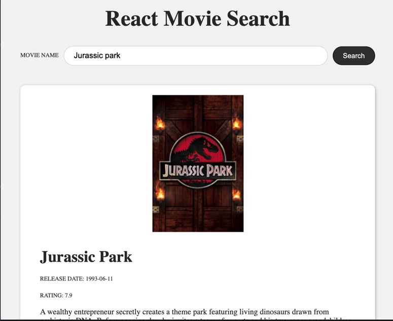

__React Movie Search App__




Quick start:

```
$ yarn # npm install
$ yarn build # npm run build
```

## Development

Run Webpack in watch-mode to continually compile the JavaScript as you work:

```

$ yarn watch # npm run watch
```

